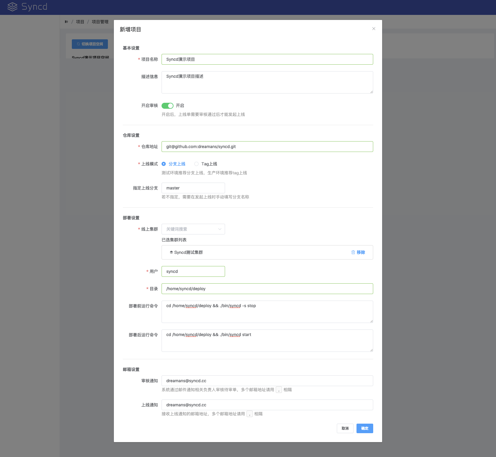

# 项目配置

## 项目空间

项目空间是项目的基本组织单元，是进行项目和多用户隔离和访问控制的主要边界。

    项目 -> 空间管理 -> 新增项目空间

## 项目管理

    项目 -> 项目管理 -> [切换项目空间] -> 新增项目

## 成员管理

只有将用户添加到该项目空间，成为空间成员后才具有相应的权限。

    项目 -> 成员管理 -> [切换项目空间] -> 添加新成员

在 `添加新成员` 输入框中输入待加入成员的关键词，选中用户后点击添加。

[filename](include/footer.md ':include')