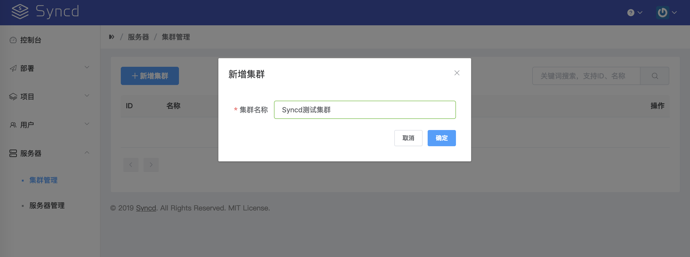

# 集群配置

## 添加集群

在创建项目前，需要先添加好项目所需的服务器集群，新建集群步骤如下：

    服务器 -> 集群管理 -> 新增集群

按实际情况输入集群名称，如图：

## 添加服务器

在新建的集群中添加服务器信息，步骤如下：

    服务器 -> 服务器管理 -> 新增服务器

## 秘钥配置

由于部署服务器（Syncd服务所在的服务器）与生产服务器（代码部署目标机）之间通过ssh协议通信，所以需要将部署服务器的公钥 (一般在这里: `$HOME/.ssh/id_rsa.pub`)加入到生产机的信任列表中（一般在这里 `$HOME/.ssh/authorized_keys`）

可使用 `ssh-copy-id` 命令添加，或手动拷贝。

设置完成后不要忘记进行测试连通性 `ssh {生产机用户名}@{生产机地址}`

> 注意：部署服务器的$HOME必须与运行Syncd的用户一致，否则ssh的免密登录将无效。

[filename](include/footer.md ':include')